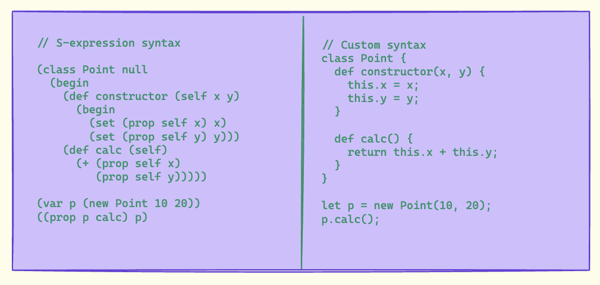

In our [previous post](https://isagi.in/blog/statements-and-lists/), we implemented statement lists. Now, let's add support for block statements and nested scopes.

## Block Statements



Block statements group multiple statements together and create new scopes. They're fundamental for:
- Function bodies
- If statement branches
- Loop bodies
- Local scope creation

### Updated Grammar

Let's extend our grammar to support blocks:

```bnf
Statement
  : ExpressionStatement
  | BlockStatement
  | EmptyStatement
  ;

BlockStatement
  : "{" OptStatementList "}"
  ;

OptStatementList
  : StatementList
  | ε
  ;

EmptyStatement
  : ";"
  ;
```

## Deep Dive: Block Statements and Scope

### Why Blocks Matter

Block statements serve multiple purposes:

1. **Scope Isolation**: They create a new lexical scope, preventing variable name collisions and controlling visibility
2. **Memory Management**: Help with garbage collection by clearly defining variable lifetimes
3. **Code Organization**: Provide visual and logical grouping of related statements
4. **Control Flow**: Essential for defining boundaries in if/else, loops, and functions

### The Anatomy of Block Processing

When our parser encounters a block statement, several important things happen:

1. **Token Recognition**: The parser identifies the opening `{`
2. **Scope Creation**: (In interpreters) A new scope object/environment would be created
3. **Statement Collection**: All statements until the matching `}` are parsed
4. **Scope Resolution**: (In interpreters) The scope is popped when leaving the block

Here's a detailed look at the process:

```javascript
/**
 * BlockStatement handles both the syntactic structure and prepares
 * for semantic analysis. The body array maintains statement order,
 * which is crucial for proper execution flow.
 */
BlockStatement() {
  // 1. Enter new scope (for interpreters)
  // this._symbolTable.enterScope();

  this._eat('{');
  
  // 2. Process all statements in the block
  const body = this._lookahead.type !== '}' 
    ? this.StatementList('}')
    : [];
    
  this._eat('}');
  
  // 3. Exit scope (for interpreters)
  // this._symbolTable.exitScope();

  return {
    type: 'BlockStatement',
    body,
  };
}
```

### Understanding the AST Structure

The AST structure for blocks is hierarchical, reflecting the nested nature of scopes. Let's examine a complex example:

```javascript
{
  let x = 10;
  {
    let y = 20;
    {
      let z = 30;
    }
  }
}
```

This produces an AST like:

```javascript
{
  type: 'BlockStatement',
  body: [
    {
      type: 'VariableDeclaration',
      declarations: [{
        type: 'VariableDeclarator',
        id: { type: 'Identifier', name: 'x' },
        init: { type: 'NumericLiteral', value: 10 }
      }]
    },
    {
      type: 'BlockStatement',
      body: [
        {
          type: 'VariableDeclaration',
          declarations: [{
            type: 'VariableDeclarator',
            id: { type: 'Identifier', name: 'y' },
            init: { type: 'NumericLiteral', value: 20 }
          }]
        },
        {
          type: 'BlockStatement',
          body: [
            {
              type: 'VariableDeclaration',
              declarations: [{
                type: 'VariableDeclarator',
                id: { type: 'Identifier', name: 'z' },
                init: { type: 'NumericLiteral', value: 30 }
              }]
            }
          ]
        }
      ]
    }
  ]
}
```

## Implementation

Here's how we implement block statements:

```javascript
class Parser {
  /**
   * Statement
   *   : ExpressionStatement
   *   | BlockStatement
   *   | EmptyStatement
   *   ;
   */
  Statement() {
    switch (this._lookahead.type) {
      case '{':
        return this.BlockStatement();
      case ';':
        return this.EmptyStatement();
      default:
        return this.ExpressionStatement();
    }
  }

  /**
   * BlockStatement
   *   : '{' OptStatementList '}'
   *   ;
   */
  BlockStatement() {
    this._eat('{');

    const body = this._lookahead.type !== '}' 
      ? this.StatementList('}')
      : [];

    this._eat('}');

    return {
      type: 'BlockStatement',
      body,
    };
  }

  /**
   * EmptyStatement
   *   : ';'
   *   ;
   */
  EmptyStatement() {
    this._eat(';');
    return {
      type: 'EmptyStatement',
    };
  }

  /**
   * StatementList
   *   : Statement
   *   | Statement StatementList
   *   ;
   */
  StatementList(stopLookahead = null) {
    const statements = [this.Statement()];

    while (this._lookahead !== null && 
           this._lookahead.type !== stopLookahead) {
      statements.push(this.Statement());
    }

    return statements;
  }
}
```

## Testing Block Statements

Let's write comprehensive tests for our block implementation:

```javascript
describe('Parser: Block Statements', () => {
  let parser;

  beforeEach(() => {
    parser = new Parser();
  });

  describe('Basic Blocks', () => {
    test('parses empty block', () => {
      const ast = parser.parse('{}');
      expect(ast).toEqual({
        type: 'Program',
        body: [{
          type: 'BlockStatement',
          body: []
        }]
      });
    });

    test('parses block with statements', () => {
      const ast = parser.parse(`{
        42;
        "hello";
      }`);
      
      expect(ast).toEqual({
        type: 'Program',
        body: [{
          type: 'BlockStatement',
          body: [
            {
              type: 'ExpressionStatement',
              expression: { type: 'NumericLiteral', value: 42 }
            },
            {
              type: 'ExpressionStatement',
              expression: { type: 'StringLiteral', value: 'hello' }
            }
          ]
        }]
      });
    });
  });

  describe('Nested Blocks', () => {
    test('parses nested blocks', () => {
      const ast = parser.parse(`{
        42;
        {
          "hello";
        }
      }`);
      
      expect(ast).toEqual({
        type: 'Program',
        body: [{
          type: 'BlockStatement',
          body: [
            {
              type: 'ExpressionStatement',
              expression: { type: 'NumericLiteral', value: 42 }
            },
            {
              type: 'BlockStatement',
              body: [
                {
                  type: 'ExpressionStatement',
                  expression: { type: 'StringLiteral', value: 'hello' }
                }
              ]
            }
          ]
        }]
      });
    });
  });

  describe('Empty Statements', () => {
    test('parses empty statement', () => {
      const ast = parser.parse(';');
      expect(ast).toEqual({
        type: 'Program',
        body: [{
          type: 'EmptyStatement'
        }]
      });
    });

    test('parses multiple empty statements', () => {
      const ast = parser.parse(';;;');
      expect(ast).toEqual({
        type: 'Program',
        body: [
          { type: 'EmptyStatement' },
          { type: 'EmptyStatement' },
          { type: 'EmptyStatement' }
        ]
      });
    });
  });
});
```

## Key Implementation Details

1. **Predictive Parsing**: We use the lookahead token to determine which type of statement to parse:
   - `{` indicates a block statement
   - `;` indicates an empty statement
   - Otherwise, we assume an expression statement

2. **Optional Statement Lists**: Block statements can be empty or contain multiple statements. We handle this by checking if the next token is `}` before parsing the statement list.

3. **Nested Scopes**: Block statements can naturally contain other block statements, creating nested scopes. This falls out naturally from our recursive descent parser design.

## Common Edge Cases

Watch out for these scenarios:

```javascript
// Empty blocks
{}

// Nested empty blocks
{ {} }

// Multiple empty statements
;;;

// Mixed blocks and empty statements
{
  42;
  ;
  {
    "hello";
  }
  ;
}
```

## AST Format Flexibility

While we've been using a specific AST format throughout our implementation, it's worth exploring how we can make our parser more flexible by supporting different AST formats.

### Current Approach vs. Factory Pattern

Currently, we create AST nodes directly in our parser methods:

```javascript
BlockStatement() {
  this._eat('{');
  const body = this._lookahead.type !== '}' 
    ? this.StatementList('}')
    : [];
  this._eat('}');

  return {
    type: 'BlockStatement',
    body,
  };
}
```

A more maintainable approach is to use the Factory pattern:

```javascript
// AST Node Factories
const DefaultFactory = {
  Program(body) {
    return {
      type: 'Program',
      body,
    };
  },

  BlockStatement(body) {
    return {
      type: 'BlockStatement',
      body,
    };
  },

  EmptyStatement() {
    return {
      type: 'EmptyStatement',
    };
  }
};

// S-expression Factory for LISP-like format
const SExpressionFactory = {
  Program(body) {
    return ['begin', ...body];
  },

  BlockStatement(body) {
    return ['begin', ...body];
  },

  EmptyStatement() {
    return [];
  }
};

class Parser {
  constructor(astFormat = 'default') {
    this._factory = astFormat === 'default' ? DefaultFactory : SExpressionFactory;
  }

  BlockStatement() {
    this._eat('{');
    const body = this._lookahead.type !== '}' 
      ? this.StatementList('}')
      : [];
    this._eat('}');

    return this._factory.BlockStatement(body);
  }
}
```

### Benefits of Factory Pattern

1. **Format Flexibility**: Easy to switch between different AST formats
2. **Separation of Concerns**: Parsing logic is decoupled from AST structure
3. **Maintainability**: AST format changes only require updating the factory
4. **Multiple Outputs**: Support for various use cases (e.g., different tools or languages)

### Example Outputs

Default AST format:
```javascript
{
  type: 'Program',
  body: [{
    type: 'BlockStatement',
    body: [{
      type: 'ExpressionStatement',
      expression: { type: 'NumericLiteral', value: 42 }
    }]
  }]
}
```

S-expression format:
```javascript
['begin',
  ['begin',
    42
  ]
]
```

### Advanced Factory Pattern Implementation

Let's dive deeper into how the Factory pattern can be implemented with more sophisticated features:

```javascript
class ASTNodeFactory {
  constructor(format = 'default', options = {}) {
    this.format = format;
    this.options = {
      includeLocation: false,
      preserveComments: false,
      ...options
    };
  }

  createNode(type, properties) {
    // Add source location if enabled
    if (this.options.includeLocation) {
      properties.loc = this.getCurrentLocation();
    }

    switch (this.format) {
      case 'default':
        return {
          type,
          ...properties
        };

      case 'sexpr':
        return this.createSExpression(type, properties);

      case 'minimal':
        return this.createMinimalNode(type, properties);

      default:
        throw new Error(`Unsupported AST format: ${this.format}`);
    }
  }

  createSExpression(type, { body, expression, value }) {
    switch (type) {
      case 'Program':
      case 'BlockStatement':
        return ['begin', ...(body || [])];
      case 'ExpressionStatement':
        return expression;
      case 'NumericLiteral':
        return value;
      // ... other cases
    }
  }

  createMinimalNode(type, properties) {
    // Strip out unnecessary properties for a minimal AST
    const essentialProps = this.getEssentialProperties(type);
    return Object.fromEntries(
      Object.entries(properties)
        .filter(([key]) => essentialProps.includes(key))
    );
  }

  getCurrentLocation() {
    // Implementation for tracking source locations
    return {
      start: { line: 0, column: 0 },
      end: { line: 0, column: 0 }
    };
  }
}
```

This enhanced factory implementation provides:

1. **Configurable Output**: Different AST formats from the same parser
2. **Source Location Tracking**: Optional inclusion of source positions
3. **Minimal AST Option**: Stripped-down AST for specific use cases
4. **Comment Preservation**: Optional retention of comments in the AST

### Exercise for Readers

Try extending the parser to support:

1. Block-level comments inside blocks
2. Multiple blocks at the top level
3. Error recovery for mismatched braces

Here's a starting point for brace matching:

```javascript
_validateBraces() {
  let depth = 0;
  for (const token of this._tokens) {
    if (token.type === '{') depth++;
    if (token.type === '}') depth--;
    if (depth < 0) throw new SyntaxError('Unexpected closing brace');
  }
  if (depth !== 0) throw new SyntaxError('Missing closing brace');
}
```
