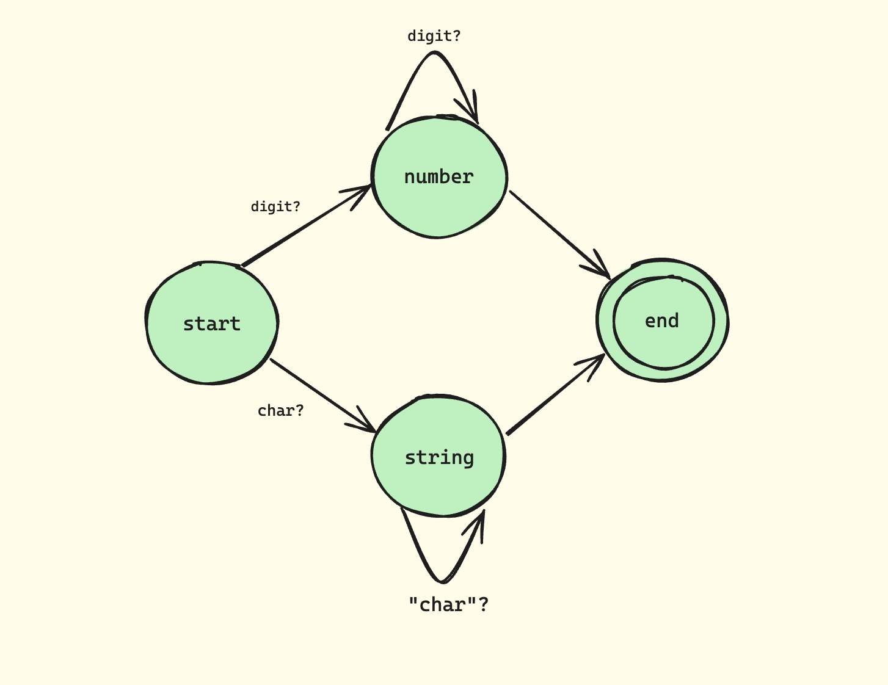

In our [previous post](https://isagi.in/blog/numbers-and-strings/), we implemented a basic tokenizer that handles numeric and string literals. Today, we'll explore how our tokenizer's implementation relates to finite state machines and how we can leverage regular expressions to create a more elegant and maintainable solution.

## Understanding Finite State Machines

Before diving into the implementation, let's take a moment to understand what finite state machines are and how they relate to our tokenizer.

A finite state machine (FSM) is a mathematical model of computation that describes an abstract machine that can be in exactly one of a finite number of states at any given time. The FSM can change from one state to another in response to some inputs; this is called a transition.

In the context of our tokenizer, each token type can be thought of as a state in our FSM. The input characters drive the transitions between these states.

### Example: Number/String State Machine



This diagram illustrates:
1. We start in the START state
2. Upon encountering a digit [0-9], we transition to the NUMBER state
3. We stay in the NUMBER state as long as we keep seeing digits
4. When we encounter a non-digit [^0-9], we transition to the END state

Our current tokenizer implementation essentially functions as this state machine. For example, when processing numbers, we:
1. Enter the "number state" upon encountering a digit
2. Stay in that state while consuming subsequent digits
3. Exit the state when we encounter a non-digit character

This pattern of "a digit repeated one or more times" is precisely what regular expressions are designed to handle. The regular expression `\d+` captures this exact behavior, making our code more concise and maintainable.

## Regular Expressions: A Powerful Tool for Tokenization

Regular expressions (regex) are a sequence of characters that define a search pattern. They are incredibly powerful for text processing and pattern matching. In the context of our tokenizer, they allow us to define complex patterns succinctly.

### Key Regex Concepts for Tokenization

1. **Character Classes**: 
   - `\d`: Matches any digit (equivalent to [0-9])
   - `\s`: Matches any whitespace character
   - `\w`: Matches any word character (alphanumeric + underscore)

2. **Quantifiers**:
   - `+`: One or more occurrences
   - `*`: Zero or more occurrences
   - `?`: Zero or one occurrence

3. **Anchors**:
   - `^`: Start of the string
   - `$`: End of the string

4. **Groups and Capturing**:
   - `()`: Groups expressions and creates a capture group
   - `(?:)`: Non-capturing group

5. **Character Sets**:
   - `[...]`: Matches any single character in the brackets
   - `[^...]`: Matches any single character not in the brackets

Understanding these concepts will help you create more sophisticated token patterns.

## Refactoring with Regular Expressions

Let's refactor our tokenizer to use regular expressions. First, we'll define a specification that maps patterns to token types:

```javascript
class Tokenizer {
  /**
   * Specification of token patterns
   */
  spec = [
    // Numbers: sequence of digits
    [/^\d+/, 'NUMBER'],
    
    // Double quoted strings
    [/^"[^"]*"/, 'STRING'],
    
    // Single quoted strings
    [/^'[^']*'/, 'STRING'],
    
    // Whitespace: ignored
    [/^\s+/, null],
    
    // Single-line comments
    [/^\/\/.*/, null],
    
    // Multi-line comments
    [/^\/\*[\s\S]*?\*\//, null],
  ];

  init(string) {
    this._string = string;
    this._cursor = 0;
  }

  isEOF() {
    return this._cursor >= this._string.length;
  }

  hasMoreTokens() {
    return this._cursor < this._string.length;
  }

  /**
   * Obtains next token.
   */
  getNextToken() {
    if (!this.hasMoreTokens()) {
      return null;
    }

    const string = this._string.slice(this._cursor);

    for (const [regexp, tokenType] of this.spec) {
      const tokenValue = this._match(regexp, string);
      
      if (tokenValue == null) {
        continue;
      }

      // Skip comments and whitespace
      if (tokenType == null) {
        return this.getNextToken();
      }

      return {
        type: tokenType,
        value: tokenValue,
      };
    }

    throw new SyntaxError(`Unexpected token: "${string[0]}"`);
  }

  /**
   * Matches a token for a regular expression.
   */
  _match(regexp, string) {
    const matched = regexp.exec(string);
    if (matched === null) {
      return null;
    }
    this._cursor += matched[0].length;
    return matched[0];
  }
}
```

## Understanding the Implementation

### The Specification

The tokenizer specification is a list of pairs, each containing:
1. A regular expression pattern
2. The corresponding token type

```javascript
spec = [
  [/^\d+/, 'NUMBER'],           // Numbers
  [/^"[^"]*"/, 'STRING'],       // Double-quoted strings
  [/^'[^']*'/, 'STRING'],       // Single-quoted strings
  [/^\s+/, null],               // Whitespace (ignored)
  [/^\/\/.*/, null],            // Single-line comments
  [/^\/\*[\s\S]*?\*\//, null],  // Multi-line comments
];
```

Let's break down each pattern:

1. `/^\d+/`: Matches one or more digits at the start of the string
2. `/^"[^"]*"/`: Matches a double-quoted string
   - `^"`: Start with a double quote
   - `[^"]*`: Match any character that's not a double quote, zero or more times
   - `"`: End with a double quote
3. `/^'[^']*'/`: Similar to the above, but for single-quoted strings
4. `/^\s+/`: Matches one or more whitespace characters
5. `/^\/\/.*/`: Matches single-line comments
   - `^\/\/`: Start with two forward slashes
   - `.*`: Match any character (except newline) zero or more times
6. `/^\/\*[\s\S]*?\*\//`: Matches multi-line comments
   - `^\/\*`: Start with `/*`
   - `[\s\S]*?`: Match any character (including newlines) zero or more times, non-greedily
   - `\*\/`: End with `*/`

### Pattern Matching

The `_match` method handles the core pattern matching:
- Tests if the pattern matches at the current position
- Updates the cursor position
- Returns the matched text

```javascript
_match(regexp, string) {
  const matched = regexp.exec(string);
  if (matched === null) {
    return null;
  }
  this._cursor += matched[0].length;
  return matched[0];
}
```

This method uses `regexp.exec(string)` to attempt a match. If successful, it moves the cursor forward by the length of the matched text.

### Token Generation

The `getNextToken` method:
1. Tries each pattern in order
2. Skips tokens with null type (whitespace/comments)
3. Returns the first matching token
4. Throws an error if no pattern matches

This method implements the core logic of our tokenizer:

```javascript
getNextToken() {
  if (!this.hasMoreTokens()) {
    return null;
  }

  const string = this._string.slice(this._cursor);

  for (const [regexp, tokenType] of this.spec) {
    const tokenValue = this._match(regexp, string);
    
    if (tokenValue == null) {
      continue;
    }

    // Skip comments and whitespace
    if (tokenType == null) {
      return this.getNextToken();
    }

    return {
      type: tokenType,
      value: tokenValue,
    };
  }

  throw new SyntaxError(`Unexpected token: "${string[0]}"`);
}
```

This method iterates through the specification, attempting to match each pattern. When a match is found, it either skips it (for null token types) or returns a token object.

## Testing the Implementation

Let's test our enhanced tokenizer with various inputs:

```javascript
const tokenizer = new Tokenizer();

// Numbers
tokenizer.init('42');
console.log(tokenizer.getNextToken());
// Output: { type: 'NUMBER', value: '42' }

// Strings with whitespace
tokenizer.init('"Hello, world!"   \'Another string\'');
console.log(tokenizer.getNextToken());
console.log(tokenizer.getNextToken());
// Output:
// { type: 'STRING', value: '"Hello, world!"' }
// { type: 'STRING', value: "'Another string'" }

// Comments
tokenizer.init(`
  42 // This is a number
  /* Multi-line
     comment */
  "Hello"
`);
console.log(tokenizer.getNextToken());
console.log(tokenizer.getNextToken());
// Output:
// { type: 'NUMBER', value: '42' }
// { type: 'STRING', value: '"Hello"' }
```


### Exercise for Readers

To deepen your understanding and practice with regular expressions and tokenization, try extending the tokenizer to support:

1. Hexadecimal numbers (e.g., `0xFF`)
2. Scientific notation (e.g., `1.23e-4`)
3. Template literals with backticks (e.g., `` `Hello, ${name}!` ``)

Here's a hint for hexadecimal numbers:
```javascript
// Add to spec:
[/^0x[0-9a-fA-F]+/, 'NUMBER']
```

For scientific notation, consider using a pattern like:
```javascript
[/^\d+(\.\d+)?([eE][+-]?\d+)?/, 'NUMBER']
```

For template literals, you'll need to handle interpolation. This is more complex and might require adjusting the tokenizer logic. Start with a simple version:
```javascript
[/^`[^`]*`/, 'TEMPLATE_LITERAL']
```
