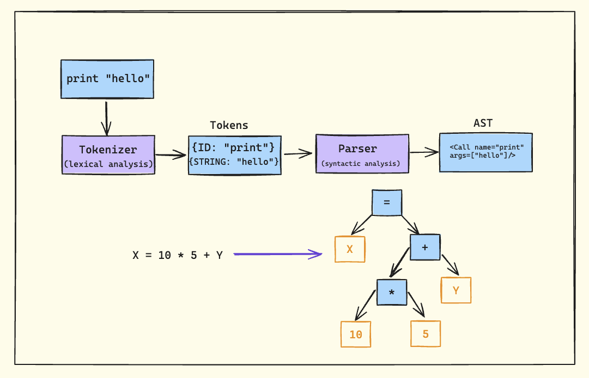

Welcome to the first blog of our series on building a parser. we'll construct a parser for a full programming language, with syntax reminiscent of Java or JavaScript.

## Why Build a Parser?

Before we dive in, let's address why you might want to build a parser from scratch:

1. To gain a deep understanding of language processing
2. For creating domain-specific languages (DSLs)
3. To build custom development tools
4. As a foundation for creating your own programming language

While we'll focus on practical implementation, those interested in deeper theoretical aspects of parsing algorithms (like LL(1), LR(1), etc.) might want to explore more specialized resources.

## The Parsing Pipeline

Let's break down the parsing process into its core components:



### 1. Tokenizer (Lexer/Scanner)

The tokenizer is the first stage of our parsing pipeline. Its job is to perform lexical analysis, breaking down the input string into a stream of tokens. Each token typically has a type and a value.

For example, given the input `print "hello"`, the tokenizer might produce:
- Token 1: `{type: "IDENTIFIER", value: "print"}`
- Token 2: `{type: "STRING", value: "hello"}`

It's crucial to understand that the tokenizer doesn't determine if a program is syntactically valid. It simply identifies and categorizes the basic elements of the language.

### 2. Parser

The parser takes the stream of tokens produced by the tokenizer and performs syntactic analysis. Its primary responsibilities are:

1. Validating that the sequence of tokens follows the language's grammar rules
2. Constructing an Abstract Syntax Tree (AST) that represents the structure of the program

## Abstract Syntax Trees (ASTs)

An AST is a tree representation of the abstract syntactic structure of source code. Let's look at an example:


In this AST:
- The root node is the addition operator (+)
- The left child is the number 7
- The right child is a multiplication expression (3 * 4)
  - The multiplication node has two children:
    - Left child: number 3 
    - Right child: number 4

This structure correctly represents the operator precedence, where multiplication has higher precedence than addition.

## Tools of the Trade

### Regular Expressions

While regular expressions aren't sufficient for parsing entire programming languages, they play a crucial role in the tokenization phase.


For instance, we might use a regex like `\d+` to match numbers in our tokenizer.

### Backus-Naur Form (BNF)

BNF is a notation technique used to describe the syntax of programming languages. It's especially useful when defining the grammar rules for our parser.


This defines a program as a list of statements, where each statement can be an assignment, an if statement, or a function declaration.

## Types of Parsers


Parsers can be broadly categorized into two types:

1. Hand-written parsers
   - Recursive-descent parsers (which we'll be focusing on)

2. Automatically generated parsers
   - LL(1), LL(k)
   - LR(k), LALR(1)
   - GLR
   - PEG

## Our Initial Parser Implementation: Understanding the Code

Let's dive deep into our initial parser implementation that handles single numbers:

```javascript
class Parser {
  constructor() {
    this.string = '';
  }

  parse(string) {
    this.string = string;
    return this.Program();
  }

  /**
   * Program
   *   : NumericLiteral
   *   ;
   */
  Program() {
    return this.NumericLiteral();
  }

  /**
   * NumericLiteral
   *   : NUMBER
   *   ;
   */
  NumericLiteral() {
    return {
      type: 'NumericLiteral',
      value: Number(this.string),
    };
  }
}
```

### The Parsing Process
1. **Initialization**: When `parse(string)` is called, it:
   - Stores the input string in the class property
   - Initiates parsing by calling `Program()`

2. **Grammar Rules**: The parser implements two simple grammar rules:
   - `Program → NumericLiteral`
   - `NumericLiteral → NUMBER`

3. **AST Construction**: The `NumericLiteral` method creates a simple AST node with:
   - A `type` property identifying it as a numeric literal
   - A `value` property containing the actual number

### Example Usage

```javascript
const parser = new Parser();
const ast = parser.parse('42');
console.log(ast);
// Output:
// {
//   type: 'NumericLiteral',
//   value: 42
// }
```

### Limitations and Next Steps
This initial implementation has several limitations:
1. It can only parse single numbers
2. It lacks error handling
3. It doesn't handle whitespace
4. It doesn't validate input format

In the next blog, we'll address these limitations by:
- Adding proper tokenization
- Implementing error handling
- Supporting multiple types of expressions
- Adding operator precedence
- Handling whitespace and comments

Each addition will build upon this foundation, gradually transforming our simple number parser into a full-featured programming language parser.


